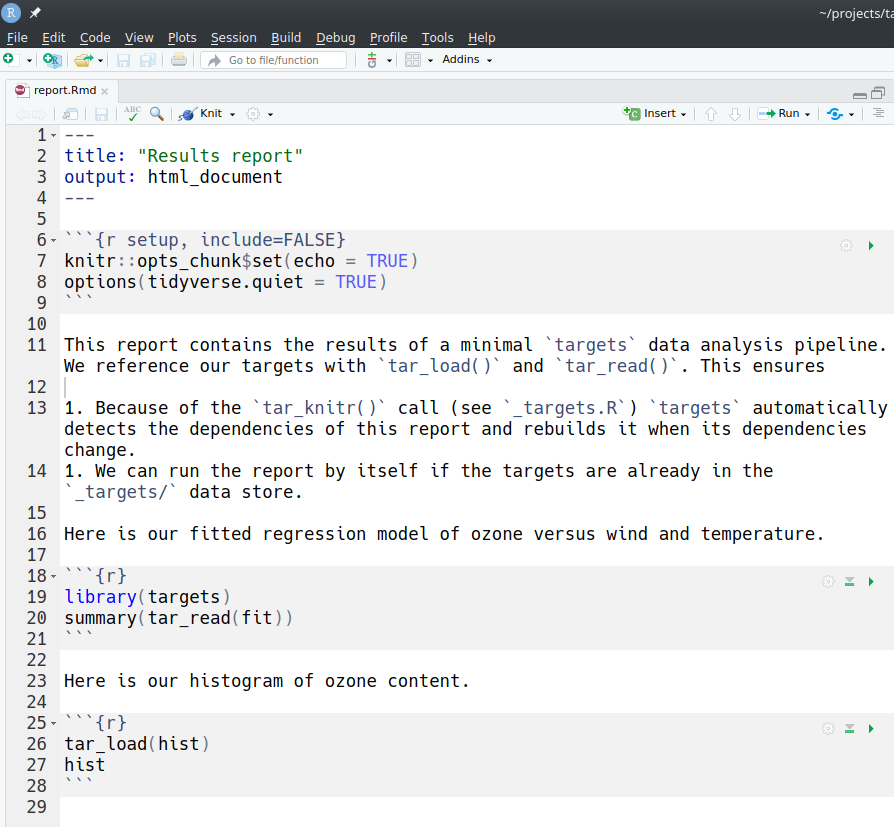
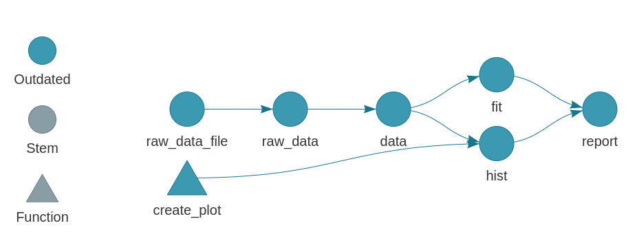

# External files and literate programming {#files}

```{r, message = FALSE, warning = FALSE, echo = FALSE}
knitr::opts_knit$set(root.dir = fs::dir_create(tempfile()))
knitr::opts_chunk$set(collapse = TRUE, comment = "#>")
```

```{r, message = FALSE, warning = FALSE, echo = FALSE}
library(targets)
```

The `targets` package automatically stores data and automatically responds to changed files to keep your targets up to date. The chapter below explains how to leverage this reproducibility for external datasets, external output files, and literate programming artifacts such as R Markdown reports. Real-world applications of these techniques are [linked from here](https://wlandau.github.io/targets/index.html#examples).

## Internal files

Each project's data lives in the `_targets/` folder in the root directory (where you call `tar_make()`). The files in the `_targets/` look like this:

```
_targets/
├── meta/
├────── progress
├────── meta
├── objects/
├────── target1 
├────── target2
├────── branching_target_c7bcb4bd
├────── branching_target_285fb6a9
├────── branching_target_874ca381
└── scratch/ # tar_make() deletes this folder after it finishes.
```

Spreadsheets `_targets/meta/meta` and `_targets/meta_progress` keep track of target metadata, and the `scratch/` directory contains temporary files which can be safely deleted after `tar_make()` finishes. The `_targets/objects/` folder contains the return values of the targets themselves.

A typical target returns an R object: for example, a dataset with `tar_target(dataset, data.frame(x = rnorm(1000)), format = "fst")` or a fitted model `tar_target(model, biglm(ozone ~ temp + wind), format = "qs")`. When you run the pipeline, `targets` computes this object and saves it as a file in `_targets/objects/`. The file name in `_targets/objects/` is always the target name, and type of the file is determined by the `format` argument of `tar_target()`, and formats `"fst"` and `"qs"` are two of many choices explained in the help file of `tar_target()`. No matter what format you pick, `targets` watches the file for changes and recomputes the target in `tar_make()` if the the file gets corrupted (unless you suppress the file cue with `tar_target(cue = tar_cue(file = FALSE))`).

## External input files

To reproducibly track an external input file, you need to define a new target and choose `format = "file"` in `tar_target()`. Targets with the `"file"` format are called dynamic files, and these targets are unusual because their return values do not get saved in the `_targets/objects/` folder. Rather, they expect you to return a character vector files and directories, which gets stored in the `_targets/meta` spreadsheet, and then `targets` watches the data at those paths for changes. The first two targets of the [minimal example](https://github.com/wlandau/targets-minimal) demonstrate this technique.

```{r}
tar_script({
  path_to_data <- function() {
    "data/raw_data.csv"
  }
  tar_pipeline(
    tar_target(
      raw_data_file,
      path_to_data(),
      format = "file"
    ),
    tar_target(
      raw_data,
      read_csv(raw_data_file, col_types = cols())
    )
  )
})
```

Above, `raw_data_file` is the dynamic file target. The file `data/raw_data.csv` exists before we ever run the pipeline, and the R expresion for the target returns the character vector `"data/raw_data.csv"`. (We use the `path_to_data()` function to demonstrate that you need not literally write `"data/raw_data.csv"` as long as the path is returned somehow.)

All subsequent targets that depend on the file must reference the file using the symbol `raw_data_file`. This allows `targets`' automatic static code analysis routines to detect which targets depend on the file. Because the `raw_data` target literally mentions the symbol `raw_data_file`, `targets` knows `raw_data` depends on `raw_data_file`. This ensures that

1. `raw_data_file` gets processed  before `raw_data`, and
1. `tar_make()` automatically reruns `raw_data` if `raw_data_file` or `"data/raw_data.csv"` change.

```{r}
tar_visnetwork()
```

If we were to omit the symbol `raw_data_file` from the R expression of `raw_data`, those targets would be disconnected in the graph and `tar_make()` would make incorrect decisions.

```{r}
tar_script({
  path_to_data <- function() {
    "data/raw_data.csv"
  }
  tar_pipeline(
    tar_target(
      raw_data_file,
      path_to_data(),
      format = "file"
    ),
    tar_target(
      raw_data,
      read_csv("data/raw_data.csv", col_types = cols()) # incorrect
    )
  )
})
```

```{r}
tar_visnetwork()
```

## External output files

We can generate and track custom external files too, and the mechanics are similar. We still return a file path and use `format = "file"`, but this time, our R command writes a file before it returns a path. For an external plot file, our target might look like this.

```{r, eval = FALSE}
tar_target(
  plot_file,
  save_plot_and_return_path(),
  format = "file"
)
```

where our custom `save_plot_and_return_path()` function does exactly what the name describes.

```{r, eval = FALSE}
save_plot_and_return_path <- function() {
  plot <- ggplot(mtcars) +
    geom_point(aes(x = wt, y = mpg))
  ggsave("plot_file.png", plot, width = 7, height = 7)
  return("plot_file.png")
}
```

## Literate programming

R Markdown reports are a little more challenging because they often depend on upstream targets. To integrate an R Markdown report with a `targets` pipeline, you must use `tar_read()` and `tar_load()` in active code chunks to explicitly name the targets that the report depends on. The report from the [minimal example](https://github.com/wlandau/targets-minimal) looks like this.



Above, the report depends on targets `fit` and `hist`. The use of `tar_read()` and `tar_load()` allows us to run the report outside the pipeline. As long as `_targets/` folder has data on the required targets from a previous `tar_make()`, you can open the RStudio IDE, edit the report, and click the Knit button like you would for any other R Markdown report.


To connect the target with the pipeline, we define a special kind of target with 4 requirements:

1. `format = "file"` in `tar_target()`.
1. `tidy_eval = TRUE` in `tar_target()` (default).
1. An R expression that returns the paths to the report's source file and the rendered output file.
1. Explicit mentions of the symbols `fit` and `hist` in the command.

The target definition looks like this.

```{r, echo = FALSE}
lines <- c(
  "---",
  "output: html_document",
  "---",
  "",
  "```{r}",
  "tar_read(fit)",
  "tar_load(hist)",
  "```"
)
writeLines(lines, "report.Rmd")
```

```{r}
tar_target(
  report, {
    render("report.Rmd", quiet = TRUE)
    c(!!tar_knitr("report.Rmd"), "report.html")
  },
  format = "file"
)
```

The `tar_knitr()` function searches reports for mentions of `tar_read()` and `tar_load()` and returns code that mentions the target names as symbols. The [tidy evaluation](https://adv-r.hadley.nz/quasiquotation.html) unquote operator `!!` tells `targets` to evaluate `tar_knitr()` right now instead of in `tar_make()`. From the print output above, you can see that the R expression of the target returns the correct file paths **and** mentions the symbols `fit` and `hist`. As a result, `targets` knows the report depends on `fit` and `hist`, and it knows that `report.Rmd` and `report.html` are the files associated with this dynamic file target.

```{r, eval = FALSE}
tar_visnetwork()
```



### Working directory

The current working directory (i.e. `getwd()`) must contain the `_targets/` data store not only when `tar_knitr()` is evaluated, but also when the actual report is run. The easiest way to deal with this is just to keep all your R Markdown source files at the root directory of the project. If you need to put your report somewhere else, such as a subdirectory, consider setting `knit_root_dir = getwd()` in `rmarkdown::render()` or `knitr::opts_knit$set(root.dir = "your_project_root_directory")` in an early code chunk of the report itself.
