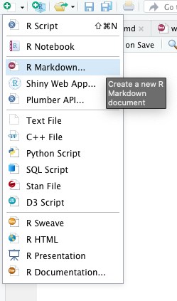
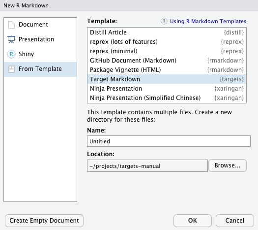

# Target Markdown {#markdown}

```{r, message = FALSE, warning = FALSE, echo = FALSE, eval = TRUE}
knitr::opts_knit$set(root.dir = fs::dir_create(tempfile()))
knitr::opts_chunk$set(collapse = TRUE, comment = "#>", eval = TRUE)
options(crayon.enabled = FALSE)
```

Target Markdown, available in `targets` > 0.4.2.9000, is a powerful R Markdown interface for reproducible analysis pipelines. With Target Markdown, you can define a fully scalable pipeline from within one or more R Markdown reports, anything from a single report to a whole `bookdown` or `workflowr` project. You get the best of both worlds: the human readable narrative of literate programming, and the sophisticated caching and dependency management systems of `targets`.

## Access

The example from this chapter is available as a Target Markdown document through RStudio R Markdown template system: https://rstudio.github.io/rstudio-extensions/rmarkdown_templates.html. In the RStudio IDE, select a new R Markdown document in the New File dropdown menu in the upper left-hand corner of the window.



Then, select the Target Markdown template and click OK to open a copy of the report for editing.



## Engine

Target Markdown uses a special `knitr` language engine. R Markdown code chunks begin with `{targets}` rather than `{r}`, and there are special chunk options:

* `tar_globals`: Logical, whether to define globals or targets. If `TRUE`, the chunk code defines functions, objects, and options common to all the targets. If `FALSE` or `NULL` (default), then the chunk returns formal targets for the pipeline.
* `tar_interactive`: Logical, whether to run in interactive mode or non-interactive mode. Defaults to the return value of `interactive()`.

## Modes

The `{targets}` engine can run in interactive or non-interactive mode. Interactive mode is for prototyping and testing, while non-interactive mode is for pipeline construction. Pipeline development is continual back-and-forth between exploratory analysis and serious runs, so most users will frequently switch modes. The default mode is whatever `interactive()` returns, so the notebook interface defaults to interactive (https://bookdown.org/yihui/rmarkdown/notebook.html) and the Knit button in RStudio defaults to non-interactive. However, you can control the mode with the `tar_interactive` chunk option. You can even set the default mode for the whole report:

````
`r ''````{r}
knitr::opts_chunk$set(tar_interactive = FALSE)
```
````

The following example demonstrates both modes.

## Example

The following example is based on the minimal `targets` project at https://github.com/wlandau/targets-minimal/. We process the base `airquality` dataset, fit a model, and display a histogram of ozone concentration.

## Packages

This example requires several R packages, and `targets` must be version 0.5.0 or above.

```{r, eval = FALSE}
# R console
install.packages(c("biglm", "dplyr", "ggplot2", "readr", "targets", "tidyr"))
```

## Setup

First, load `targets` to activate the specialized `knitr` engine for Target Markdown.

````
`r ''````{r}
library(targets)
```
````

```{r, eval = TRUE, echo = FALSE}
library(targets)
```

Optionally set the `root.dir` `knitr` option to invoke all the code chunks from the directory of your choice. This gives you control over where `targets` writes all its scripts and output data, which makes it easy to create different sub-pipelines from different reports.

````
`r ''````{r}
knitr::opts_knit$set(root.dir = "your/choice/")
```
````

Early on, you may also wish to remove the leftover `_targets_r` directory from a previous run in non-interactive mode.

````
`r ''````{r}
tar_unscript()
```
````

## Globals

As usual, your targets depend on custom functions, global objects, and `tar_option_set()` options you define before the pipeline begins. Define these globals using the `{targets}` engine with `tar_globals = TRUE` chunk option. In interactive mode, the chunk simply runs the R code in the `tar_option_get("envir")` environment (usually the global environment). 

````
`r ''````{targets, tar_globals = TRUE, tar_interactive = TRUE}
options(tidyverse.quiet = TRUE)
tar_option_set(packages = c("biglm", "dplyr", "ggplot2", "readr", "tidyr"))
create_plot <- function(data) {
  ggplot(data) +
    geom_histogram(aes(x = Ozone), bins = 12) +
    theme_gray(24)
}
```
````
```{targets, tar_globals = TRUE, tar_interactive = TRUE, echo = FALSE}
options(tidyverse.quiet = TRUE)
tar_option_set(packages = c("biglm", "dplyr", "ggplot2", "readr", "tidyr"))
create_plot <- function(data) {
  ggplot(data) +
    geom_histogram(aes(x = Ozone), bins = 12) +
    theme_gray(24)
}
```

Here is the same chunk in non-interactive mode. Normally, there is no need to duplicate chunks like this, but we do so here in order to demonstrate both modes.

````
`r ''````{targets chunk-name, tar_globals = TRUE, tar_interactive = FALSE}
options(tidyverse.quiet = TRUE)
tar_option_set(packages = c("biglm", "dplyr", "ggplot2", "readr", "tidyr"))
create_plot <- function(data) {
  ggplot(data) +
    geom_histogram(aes(x = Ozone), bins = 12) +
    theme_gray(24)
}
```
````
```{targets chunk-name, tar_globals = TRUE, tar_interactive = FALSE, echo = FALSE}
options(tidyverse.quiet = TRUE)
tar_option_set(packages = c("biglm", "dplyr", "ggplot2", "readr", "tidyr"))
create_plot <- function(data) {
  ggplot(data) +
    geom_histogram(aes(x = Ozone), bins = 12) +
    theme_gray(24)
}
```

In non-interactive mode, the chunk establishes a common `_targets.R` file and writes the R code to a script in `_targets_r/globals/`.^[The `_targets.R` file from Target Markdown never changes from chunk to chunk or report to report, so you can spread your work over multiple reports without worrying about aligning `_targets.R` scripts. Just be sure all your chunk names are unique across all the reports of a project.] It is good practice to assign explicit chunk labels because they are used as script names. (The labels of unnamed chunks depend on chunk order, which is brittle).^[All chunk labels must be unique. And for `bookdown` projects, chunk labels should only use alphanumeric characters and dashes.]

## Targets

To define targets for the workflow, use the `targets` engine with the `tar_globals` chunk option equal `FALSE` or `NULL` (default). The return value of the chunk must be a target object or a list of target objects, created by `tar_target()` or a similar function.

Below, we define a target to establish the air quality dataset in the pipeline. If you run this chunk in interactive mode, the target's R command runs, the engine tests if the output can be saved and loaded from disk correctly, and then the return value gets assigned to the `tar_option_get("envir")` environment (usually the global environment). In the process, some temporary files are created and destroyed, but your local file space will remain untouched (barring any custom side effects in your custom code).

````
`r ''````{targets, tar_interactive = TRUE}
tar_target(raw_data, airquality)
```
````
```{targets, tar_interactive = TRUE, echo = FALSE}
tar_target(raw_data, airquality)
```

After you run a target in interactive mode, the return value is available in memory.

````
`r ''````{r}
head(raw_data)
```
````
```{r}
head(raw_data)
```

For demonstration purposes, here is the same chunk in non-interactive mode. In non-interactive mode, the `{targets}` engine does not actually run any targets. Instead, it establishes a common `_targets.R` and writes the code to a script in `_targets_r/targets/`.

````
`r ''````{targets chunk-name-with-target, tar_interactive = FALSE}
tar_target(raw_data, airquality)
```
````
```{targets chunk-name-with-target, tar_interactive = FALSE, echo = FALSE}
tar_target(raw_data, airquality)
```

Next, we define more targets to process the raw data, plot a histogram, and fit a model. Remember: when it comes to targets in the pipeline, only the return value of the chunk actually counts. So if you define multiple targets in a single chunk, be sure to wrap them in a list.

````
`r ''````{targets downstream-targets}
list(
  tar_target(data, raw_data %>% filter(!is.na(Ozone))),
  tar_target(hist, create_plot(data)),
  tar_target(fit, biglm(Ozone ~ Wind + Temp, data))
)
```
````
```{targets downstream-targets, echo = FALSE}
list(
  tar_target(data, raw_data %>% filter(!is.na(Ozone))),
  tar_target(hist, create_plot(data)),
  tar_target(fit, biglm(Ozone ~ Wind + Temp, data))
)
```

In interactive mode, it is good practice to inspect the outputs to make sure the targets ran properly. You can do this with ordinary `{r}` code chunks.

````
`r ''````{r, eval = FALSE}
fit
```
````

````
`r ''````{r, eval = FALSE}
hist
```
````

## Pipeline

If you ran all the `{targets}` chunks in non-interactive mode, you are ready to run the pipeline in with `tar_make()` in an ordinary `{r}` code chunk. This time, the output is written to persistent storage at the project root.

````
`r ''````{r}
tar_make()
```
````

```{r, eval = TRUE, echo = FALSE}
tar_make()
```

## Output

You can retrieve results from the `_targets/` data store using `tar_read()` or `tar_load()`.

````
`r ''````{r}
library(biglm)
tar_read(fit)
```
````

```{r, message = FALSE, eval = TRUE, echo = FALSE}
library(biglm)
tar_read(fit)
```

````
`r ''````{r}
tar_read(hist)
```
````

```{r, eval = TRUE, echo = FALSE}
tar_read(hist)
```

The `targets` dependency graph helps your readers understand the steps of your pipeline at a high level.

````
`r ''````{r}
tar_visnetwork()
```
````

```{r, eval = TRUE, echo = FALSE}
tar_visnetwork()
```

At this point, you can go back and run `{targets}` chunks in interactive mode without interfering with the code or data of the non-interactive pipeline.

